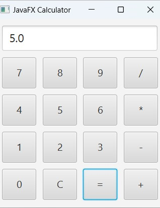

# 🔢 JavaFX Calculator App

  

> A sleek and interactive calculator desktop app built with JavaFX.
> Perform basic arithmetic operations using a clean and intuitive user interface.

---

## 🚀 Features

- ✳️ Addition, Subtraction, Multiplication, Division
- 🧹 Clear button to reset input
- 💡 Simple layout using `GridPane`
- ⚡ Fast, lightweight, responsive

---

## 📸 Application UI Preview




---

## 🎯 Technologies Used

| Technology | Purpose                 |
|------------|-------------------------|
| Java       | Core application logic  |
| JavaFX     | UI framework for Java   |
| GridPane   | Responsive layout       |
| Scene/Stage| GUI structure           |

---

## 🛠️ How to Run

### 📥 Requirements

- Java JDK 11+
- JavaFX SDK ([Download from OpenJFX](https://openjfx.io))

### ▶️ Run Steps

1. Save the code below as `CalculatorApp.java`.
2. Open it in your IDE (Eclipse, IntelliJ, VS Code, etc.).
3. Add JavaFX library in your build path.
4. Add VM options:

   ```bash
   --module-path /path/to/javafx-sdk/lib --add-modules javafx.controls
5. Run the file and enjoy your calculator!
   
## 📌 Future Improvements
 - 🧮 Add scientific calculator features
 - 🌓 Add dark/light theme toggle
 - ⌨️ Keyboard input support
 - 🔢 Show full expression above result

## 👨‍💻 Developer
** Chaithravardhan Reddy Chepati **
 - 📬 chepatichaithravardhanreddy@gmail.com

## 🌟 Like this project?
- Give it a ⭐ on GitHub or share it with others who are learning JavaFX!
